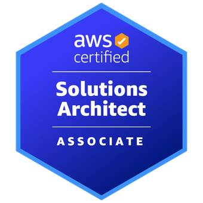

<div align="center">


<br><br>

# ☁️ Varun

### AWS Cloud Architect | DevOps | Platform Engineering

<p>
Designing secure, scalable, and resilient cloud platforms.
</p>

</div>

---

## 🏆 Certifications

<div align="center">

<table>
<tr>
<td align="center" width="33%">

<a href="YOUR_AWS_SAA_CREDLY_LINK">
  
</a>
<br><br>
<b>AWS Solutions Architect Associate</b>

</td>

<td align="center" width="33%">

<a href="YOUR_AWS_DEVOPS_CREDLY_LINK">
  
</a>
<br><br>
<b>AWS DevOps Engineer Professional</b>

</td>

<td align="center" width="33%">

<a href="YOUR_CKA_LINK">
  
</a>
<br><br>
<b>Certified Kubernetes Administrator</b>

</td>
</tr>
</table>

</div>

---

## 💼 About Me

```yaml
Role: AWS Cloud Architect

Expertise:
  - AWS Cloud Architecture
  - Multi-Account Governance
  - Landing Zone Architecture
  - Terraform Infrastructure as Code
  - Kubernetes Platform Engineering
  - CI/CD Automation
  - Security & Compliance
  - Operational Excellence
```

---

## ⚡ Technology Stack

<div align="center">


</div>

---

## 🚀 Featured Projects

<table>
<tr>
<td width="50%" valign="top">

### ☁️ AWS Multi-Account Landing Zone

✔ AWS Organizations  
✔ SCP governance  
✔ IAM guardrails  
✔ Shared services  
✔ Centralized logging  
✔ Security baseline controls  

</td>

<td width="50%" valign="top">

### 🏗 Terraform Infrastructure Automation

✔ VPC architecture  
✔ EC2 provisioning  
✔ ALB setup  
✔ Auto Scaling  
✔ Route53  
✔ IAM / RDS automation  

</td>
</tr>
</table>

---

## 📈 Contribution Activity

<div align="center">


</div>

---

## 🔥 Contribution Streak

<div align="center">


</div>

---

## 🌐 Connect

<div align="center">

<a href="https://linkedin.com/in/YOUR-LINKEDIN">
  
</a>

</div>

---

<div align="center">

### ☁️ Engineering cloud platforms that scale with confidence.

</div>
